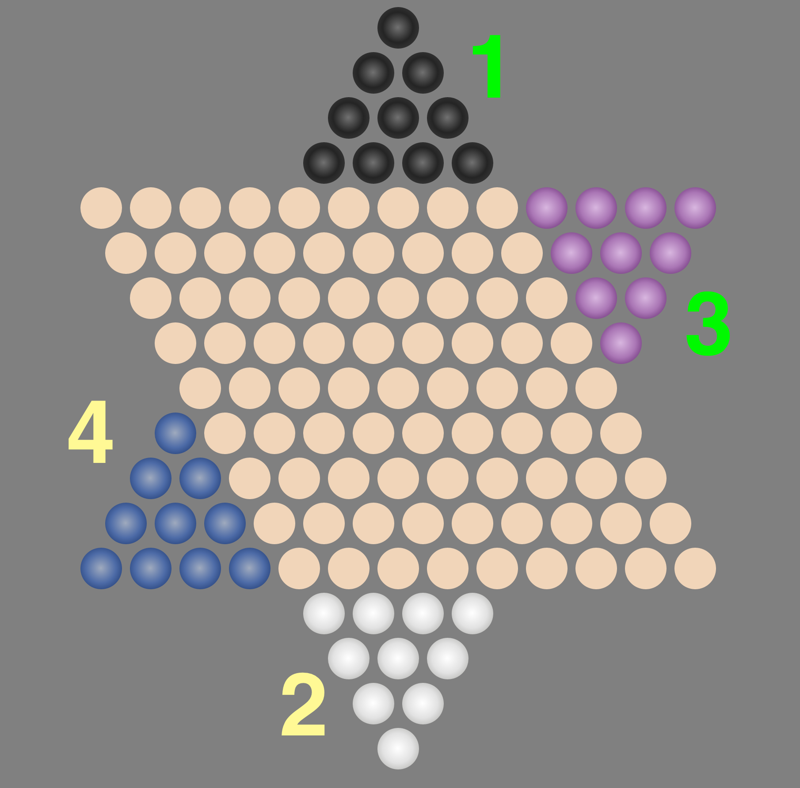

# chequers

[Play Here](http://ccann.github.io/chequers/)

Chinese Chequers

Reference: http://www.mastersgames.com/rules/chinese-checkers-rules.htm

## Game Board
The Chinese Chequers board is in the shape of a six pointed star, or hexagram. Each point
of the star is a triangle consisting of ten holes. Each triangle is a different color and
there are six sets of ten marbles with corresponding colors.

Only 2 players are currently supported but each player can have up to 3 triangles under
their control and either 10 or 15 marbles per triangle.

## Turns

The turn sequence is clockwise by home triangle, i.e. in a 4 star point game assuming
human controls North star point:

The color of the marble floating in the top right corner denotes the current turn.

## Objective
The aim of the game is to be the first to player to move all their marbles across the
board and into the triangle opposite.  The first player to occupy all destination holes
is the winner.

## Play

In one turn a marble may either be simply moved into an adjacent hole **OR** it may make
one or more hops over other marbles regardless of who controls them.

marbles are never removed from the board.  However, once a marble has reached the
opposite triangle, it may not be moved out of the triangle - only within the triangle.

## Anti-Spoiling

If a player is prevented from moving a marble into a hole in the destination triangle
because of the presence of an opposing marble in that hole, the player is entitled to
swap the opposing marble with his own.
